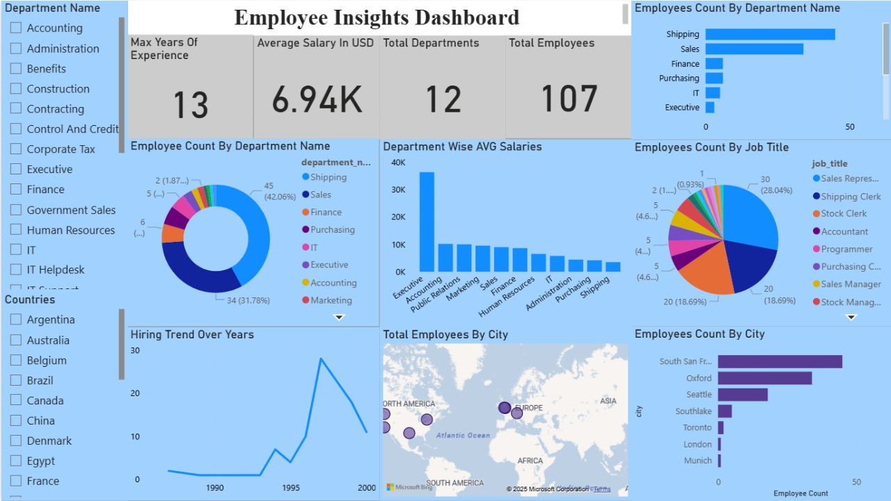

---

# 📊 Employee Insights Dashboard – Power BI

## 🧩 Overview

The **Employee Insights Dashboard** provides a detailed view of workforce data such as employee distribution, salaries, experience levels, and departmental insights. This dashboard was built using **Power BI**, connected directly to an **SQL database** containing the *Employee Schema*.

The project demonstrates how to:

* Extract data from SQL Server into Power BI
* Clean and model data for analytics
* Design an interactive dashboard for HR and business reporting

---

## 🏗️ Project Architecture

**Data Source → SQL Server → Power BI → Dashboard Visualization**

```
SQL Server (Employee Schema)
        │
        ▼
Power BI (Data Transformation using Power Query)
        │
        ▼
Interactive Employee Insights Dashboard
```

---

## 🧮 Dataset Description (Employee Schema)

| Table Name    | Description                                                                    |
| ------------- | ------------------------------------------------------------------------------ |
| `employees`   | Contains employee details such as ID, name, salary, department, and hire date. |
| `departments` | List of all departments within the organization.                               |
| `locations`   | Contains city and country information for each department or employee.         |

### Sample Columns:

* **employee_id**
* **first_name**, **last_name**
* **department_id**, **department_name**
* **hire_date**
* **salary**
* **experience_years**
* **city**, **country_name**

---

## ⚙️ Steps to Build the Dashboard (End-to-End)

### **1. Connect Power BI to SQL Server**

* Open **Power BI Desktop** → Click on **Get Data** → **SQL Server**.
* Enter the following details:

  * **Server**: your SQL instance name
  * **Database**: `employee_db` (example)
* Click **Load** to import tables (`employees`, `departments`, `locations`).

---

### **2. Data Transformation (Power Query)**

In **Power Query Editor**, perform:

* Remove duplicates and blanks.
* Format date fields (`hire_date`).
* Create calculated columns:

  * `Experience (Years)` = `DATEDIFF([hire_date], TODAY(), YEAR)`
* Merge tables:

  * Join `employees` with `departments` on `department_id`.
  * Join `employees` with `locations` on `location_id`.

Click **Close & Apply** after cleaning.

---

### **3. Data Modeling**

* Define relationships:

  * `departments[department_id]` → `employees[department_id]`
  * `locations[location_id]` → `employees[location_id]`
* Ensure relationship type = **Many-to-One** with **Cross Filter: Both**.
* Hide unnecessary columns (like IDs) for a clean model view.

---

### **4. Measure Creation (DAX)**

Create the following measures:

```DAX
Total Employees = COUNT(employees[employee_id])
Average Salary = AVERAGE(employees[salary])
Max Experience = MAX(employees[experience_years])
Department Count = DISTINCTCOUNT(employees[department_id])
```

---

### **5. Dashboard Design (Visualization Layer)**

#### KPI Cards

* **Max Experience**
* **Average Salary**
* **Department Count**
* **Total Employees**

#### Charts

* **Bar Chart** → Sum of Total Employees by Department
* **Donut Chart** → Count of Employee ID by Department ID
* **Column Chart** → Average Salary by Department Name
* **Line Chart** → Count of Hire Date by Hire Year
* **Map Visualization** → Count of Total Employees by City

#### Filters (Slicers)

* Department Name
* Country Name

---

### **6. Add Interactivity**

* Enable slicers for **department_name** and **country_name**.
* Sync filters across visuals.
* Format visuals using consistent colors and typography.

---

### **7. Save and Publish**

* Save as: `Employee_Insights_Dashboard.pbix`
* Publish to **Power BI Service** (optional) for sharing with stakeholders.

---

## 🖼️ Dashboard Preview




---

## 💾 Repository Structure

```
📁 Employee-Insights-Dashboard
│
├── data/
│   ├── employee_schema.sql
│
├── dashboard/
│   ├── Employee_Insights_Dashboard.pbix
│
├── images/
│   ├── Employee_Dashboard.png
│
└── README.md
```

---

## 🚀 How to Use

1. Clone the repository:

   ```bash
   git clone https://github.com/<your-username>/Employee-Insights-Dashboard.git
   ```
2. Import the `employee_schema.sql` file into SQL Server.
3. Open the Power BI file (`Employee_Insights_Dashboard.pbix`).
4. Update SQL connection credentials under **Transform Data → Data Source Settings**.
5. Refresh the report.

---

## 🧠 Key Insights

* Highest average salary observed in the **Executive Department**.
* **IT** and **Finance** departments have the largest workforce.
* Hiring peaked around **1995–1998**.
* Employees are distributed across **North America, Europe, and Asia**.

---

## 🛠️ Tools & Technologies Used

| Tool                                | Purpose                               |
| ----------------------------------- | ------------------------------------- |
| **SQL Server**                      | Data storage and extraction           |
| **Power BI Desktop**                | Dashboard creation                    |
| **Power Query**                     | Data cleaning and transformation      |
| **DAX (Data Analysis Expressions)** | Measure calculations                  |
| **GitHub**                          | Version control and portfolio sharing |

---

## 📚 Learning Outcomes

* Connecting Power BI to SQL Server
* Data cleaning & modeling in Power Query
* Building KPIs and measures in DAX
* Designing and formatting professional dashboards

---

## 👨‍💻 Author


**AvB**

**Happy Learning!!**

**DM in Linkedin for further queries**

---

